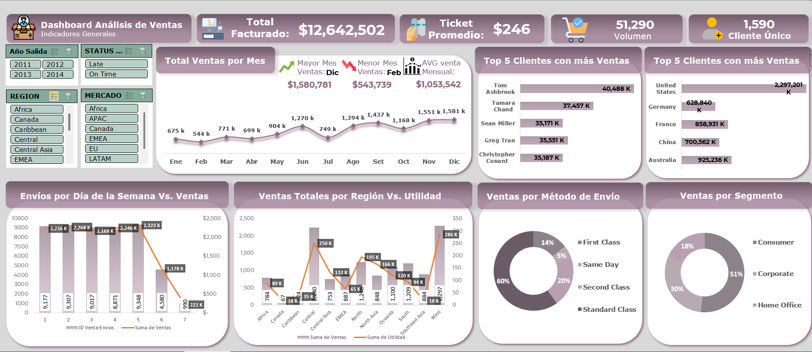

# 🌟 Proyecto en Excel: Dashboard Interactivo para EnelMart 🌟

## Descripción del Proyecto
EnelMart, una empresa líder en la venta de productos de oficina y mobiliario, necesita una herramienta interactiva para gestionar y analizar sus operaciones comerciales. El proyecto tiene como objetivo optimizar sus estrategias comerciales y mantener su posición en la industria global mediante el uso de un **dashboard personalizado** creado en **Excel**.

🎯 **Propósito:**
Desarrollar un **dashboard interactivo en Excel** que permita analizar los datos de ventas, clientes y rendimiento por región de EnelMart, ayudando a la empresa a identificar oportunidades de crecimiento y tomar decisiones informadas.

---

## Componentes del Dashboard

1. **Ventas a lo largo del tiempo**
   - Gráficos de líneas que muestran las ventas históricas para identificar patrones estacionales y ciclos de demanda.
   - Análisis por períodos clave: mensual y anual, para evaluar el rendimiento de productos específicos.

2. **Identificación de Clientes Valiosos**
   - Segmentación de clientes basada en el valor de sus compras.
   - Gráficos dinámicos que muestren los clientes más importantes según diferentes métricas de valor.

3. **Ventas por País, Región y Mercado**
   - Análisis por región para identificar mercados clave y áreas de oportunidad.

4. **Segmentación de Clientes**
   - Segmentación de clientes para identificar patrones de comportamiento y mejorar la focalización de estrategias de marketing.
---

## Metodología

- **Extracción de datos:** Recopilación y consolidación de los datos de ventas y clientes a partir de sistemas internos de EnelMart.
- **Análisis en Excel:** Creación de tablas dinámicas y uso de segmentadores para filtrar información en tiempo real.
- **Gráficos y Visualizaciones:** Uso de gráficos de líneas, columnas, mapas y tablas dinámicas para representar los insights clave del negocio.

---

## Beneficios del Dashboard

- **Visión clara de las ventas** a lo largo del tiempo, lo que permite a la empresa identificar tendencias y tomar decisiones basadas en datos históricos.
- **Segmentación eficiente** de clientes valiosos y mercados geográficos para enfocar estrategias comerciales.
- **Análisis interactivo** que permite a los usuarios filtrar información por productos, regiones o clientes.

---

## Recursos

---

## Etiquetas

`#Excel` `#Dashboard` `#DataVisualization` `#BusinessIntelligence` `#Ventas` `#Segmentación` `#DataAnalysis` `#Storytelling`

## Dashboard:
